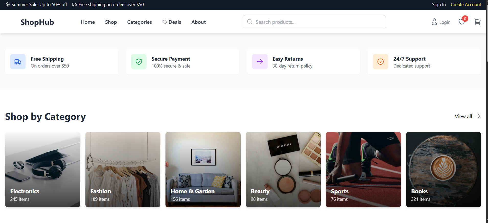
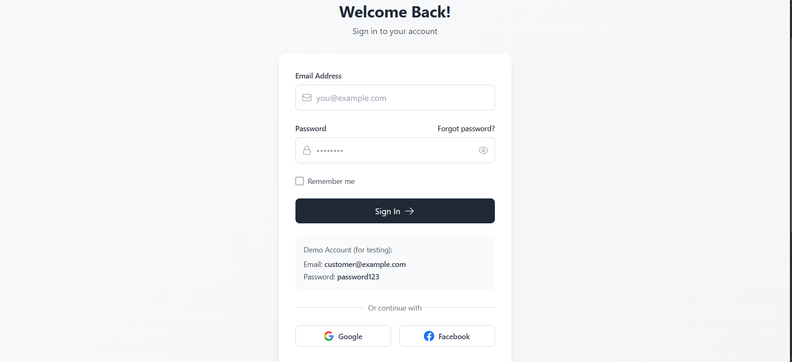

# 🛒 E-Commerce Web Application (Full Stack)

A modern full-stack E-Commerce web application built using **React (Vite)** for the frontend and **Spring Boot** for the backend. The platform supports secure **JWT-based authentication**, product management, and seamless integration with REST APIs.

---

## 🚀 Live Demo

Live link -> https://shopcherry.netlify.app/

---

## 📸 Screenshots

### 🏠 Home Page

### 🔐 Authentication (Login / Signup)

---

## 🛠 Tech Stack

### Frontend

* React (Vite)
* Tailwind CSS
* Axios

### Backend

* Spring Boot
* Spring Security
* JWT Authentication
* JPA / Hibernate

### Database

* MySQL

---

## 🔐 Features

* User Registration & Login (JWT Authentication)
* Protected Routes
* Add / View Products
* Secure API Communication
* Responsive UI
* Error Handling & Toast Notifications

---

## ⚙️ Environment Variables

### Frontend (`.env`)

VITE_BASE_URL=http://localhost:8080

### Backend (`application.properties`)

spring.datasource.url=jdbc:mysql://localhost:3306/ecommerce
spring.datasource.username=YOUR_USERNAME
spring.datasource.password=YOUR_PASSWORD

---

## ▶️ Run Locally

### 1️⃣ Clone Repository

git clone https://github.com/your-username/your-repo.git
cd ecommerce

### 2️⃣ Run Backend (Spring Boot)

cd ecommerceBackend
mvn spring-boot:run

### 3️⃣ Run Frontend (Vite)

cd ecommerceFrontend
npm install
npm run dev

---

## 📂 Project Structure

ecommerce/
├── ecommerceFrontend/
├── ecommerceBackend/

---

## 🚀 Future Improvements

* Order Management System
* Admin Dashboard Enhancements
* Product Image Upload (Cloudinary)

---

## 👨‍💻 Author

**Md Ezaj**
Full Stack Developer (Java + React)

---
